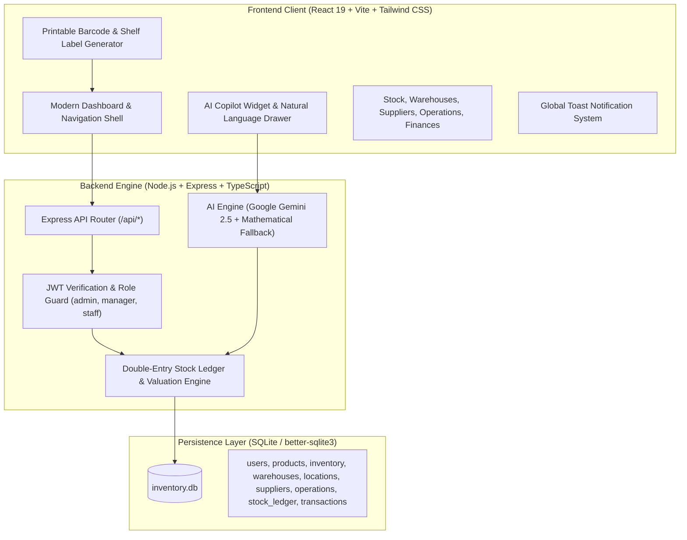

# Inventra — Enterprise Inventory & Warehouse Operating System

<div align="center">

[](LICENSE)
[](https://react.dev/)
[](https://nodejs.org/)
[](https://ai.google.dev/)
[](https://docker.com)
[](https://github.com/Destroyerved/inventra-inventory-system)

<p align="center">
  <strong>A modern, zero-error, one-stop inventory operating platform for multi-warehouse businesses, supply chains, and fast-growing logistics teams.</strong>
</p>

<p align="center">
  <a href="https://inventra-inventory-system.onrender.com/"><strong>Explore Live Web App »</strong></a>
  &nbsp;•&nbsp;
  <a href="https://github.com/Destroyerved/inventra-inventory-system/releases/download/v2.0.0/Inventra-Floor-Terminal-v2.0.0.apk"><strong>📲 Download Android APK (v2.0.0) »</strong></a>
</p>

</div>

---

## 🌟 Executive Overview

**Inventra** replaces fragmented spreadsheets and legacy ERP software with an intuitive, unified operating hub. Engineered from the ground up to solve stockouts, blind inventory transfers, and broken supply chains, Inventra provides real-time multi-location stock telemetry, an immutable double-entry stock ledger, printable barcode label generation, and an embedded **Gemini AI Inventory Copilot**.

Awarded **2nd Runner Up** at **Codeversity Hackathon 2026 @ IIT Gandhinagar**.

---

## ⚡ The One-Stop Solution: Core Capabilities

### 1. 📱 Mobile Floor Companion Terminal (`/mobile`)
- **Factory Floor Ergonomics**: Dedicated mobile web terminal engineered for smartphone and rugged scanner operation (Zebra, Honeywell, OtterBox handhelds) with thumb-optimized touch targets.
- **Goods In Intake & Receiving**: Scan incoming carton barcodes or PO QR tags at the loading dock, verify physical quantities against purchase orders, and post receipts directly to the ledger.
- **Guided Pick & Pack Fulfillment**: Route-optimized pick sequences sorted by warehouse aisle; scans verify SKUs before packing to eliminate incorrect dispatches.
- **Cycle Count HUD & Fast Reconciliation**: Point camera at any rack or product for instant stock telemetry, safety thresholds, and quick-adjust reconciliation buttons (`+1`, `-1`, `+5`, `-5`).
- **Audio & Haptic Feedback**: Web Audio API tone synthesis (880Hz dual chime on match, 220Hz buzz on mismatch) and haptic vibration (`navigator.vibrate`) engineered for loud factory environments.
- **Mobile Thermal Label Printing**: Generates formatted adhesive asset tags (Code 128 & QR) ready for mobile Bluetooth thermal sticker printers.
- **Instant QR Pairing**: Warehouse operators scan the desktop screen QR launcher to open the mobile terminal in seconds with zero app store install.

### 2. 🗺️ Interactive 2D Warehouse Floor Map & Heatmap
- **Architectural Digital Twin**: Visual 2D floor grid showing warehouse zones (Inbound Receiving Dock, High-Velocity Storage Aisles A/B/C, Bulk Pallet Reserve, and Outbound Dispatch).
- **Color-Coded Capacity Heatmaps**: Real-time bin occupancy detection (Empty: Gray, Healthy: Emerald, Dense Capacity: Indigo, Stockout Risk: Rose).
- **Bin Telemetry Inspector**: Click any rack or shelf to inspect stored SKUs, physical quantities, and initiate instant stock transfers or cycle count adjustments.

### 3. ⚡ Global Command Palette (`Ctrl + K` / `Cmd + K`)
- **Spotlight Search**: Raycast-style keyboard navigation across the entire ERP catalog, warehouse facilities, and vendor records.
- **Instant Actions**: Create inbound receipts, generate delivery orders, transfer stock, print barcodes, launch mobile terminal, and toggle dark/light mode with keyboard hotkeys.

### 4. 🛒 1-Click Intelligent Restock Wizard
- **Automated Replenishment Calculator**: Evaluates current stock against safety reorder points and 30-day outbound velocity to suggest optimal replenishment lots.
- **Multi-Vendor PO Generation**: Automatically batches critical SKUs by preferred supplier and creates draft Inbound Purchase Receipts (`WH/IN/`) in 1 click.

### 5. 🤖 Executive Intelligence Telemetry (Bento Ribbon)
- **Zero-Slop Minimalist Aesthetic**: High-signal Bento grid delivering depletion runway, outbound velocity, and capital efficiency ratios without bulky, distracting purple widgets.
- **Dual-Engine Intelligence**: Powered by **Google Gemini 2.5 / 1.5** with deterministic mathematical burn-rate fallback when offline.
- **Spotlight Natural Language Copilot**: Unobtrusive slide-out drawer answering complex inventory questions in plain English.

### 6. 🏷️ Printable Barcode & Shelf Label Generator
- **Universal Barcode Tagging**: Generates high-resolution vector barcodes and QR tags for any SKU or product.
- **Printable Sticker Sheets**: Instant formatted sheet generator (`@media print` optimized) supporting single-unit labels and multi-label adhesive sheets for warehouse racks.
- **Integrated Camera Scanner**: Scan physical barcodes directly from any mobile or desktop camera to validate shipments.

### 7. 🚚 Supplier Relationship Management (SRM)
- **Approved Vendor Directory**: Comprehensive contact book tracking supplier terms, SLAs, addresses, and catalog affiliations.
- **Seamless Procurement**: Direct "Inbound Receipt" pipeline pre-populating vendor details and scheduled delivery dates.

### 8. 🛡️ Immutable Stock Ledger & Operations Pipeline
- **Four Core Operation Routes**: Inbound Receipts (`WH/IN/`), Outbound Deliveries (`WH/OUT/`), Internal Transfers (`WH/INT/`), and Stock Adjustments (`WH/ADJ/`).
- **Audit-Proof Stock Moves**: Every physical unit change is recorded in an immutable ledger (`SM/00001`...) with user attribution.
- **PDF Packing Slips**: One-click packing slip and delivery bill generation via `jspdf`.

### 9. 💰 Real-Time Operational Finances
- **Live Margin Analytics**: Automatic revenue recording for fulfilled deliveries and expense calculation for received supplier purchase orders.
- **Financial Pulse**: Real-time Net Profit, Total Revenue, and Operating Expenses breakdown with CSV export.

---

## 🏗️ System Architecture



---

## 💻 Tech Stack

| Layer | Technologies |
| :--- | :--- |
| **Frontend** | React 19, TypeScript, Vite, Tailwind CSS 4, Recharts, Lucide Icons, Zustand, Framer Motion |
| **Backend** | Node.js, Express, TypeScript, Better-SQLite3, JWT, BcryptJS |
| **AI Intelligence** | Google Gemini SDK (`@google/genai`), Predictive Demand Modeling |
| **Document & Hardware** | jsPDF, jsPDF-AutoTable, HTML5-QRCode Scanner, Native SVG Barcode Generator |
| **DevOps & Container** | Docker, Docker Compose, Render Cloud Platform |

---

## 🚀 Getting Started

### Prerequisites
- **Node.js** 20+ (LTS recommended)
- **npm** 9+

### 1. Clone & Install Dependencies
```bash
git clone https://github.com/Destroyerved/inventra-inventory-system.git
cd inventra-inventory-system
npm install
```

### 2. Environment Configuration
Create a `.env` file in the project root:
```env
PORT=3000
NODE_ENV=development
APP_URL=http://localhost:3000
# Optional: Add your Gemini API key for live AI Copilot intelligence
GEMINI_API_KEY=your_gemini_api_key_here
```
> *Note: Inventra runs out of the box with zero errors even without a Gemini API key by automatically activating its deterministic predictive forecasting engine.*

### 3. Run Development Server
```bash
npm run dev
```
The server will start at `http://localhost:3000` with Vite Hot Module Replacement (HMR).

### 4. Production Build & Start
```bash
npm run build
npm start
```

---

## 🐳 Docker Deployment

Inventra is containerized for zero-configuration cloud deployment:

```bash
# Build the Docker image
docker build -t inventra-app .

# Run container on port 3000
docker run -d -p 3000:3000 --env-file .env --name inventra inventra-app
```

---

## 🔑 Demo Access Credentials

The database initializes with seed telemetry and sample user accounts:

| Role | Login ID | Email | Password | Permissions |
| :--- | :--- | :--- | :--- | :--- |
| **System Admin** | `admin123` | `admin@inventra.com` | `admin123` | Full administrative control, user & settings management |
| **Operations Manager** | `manager1` | `manager@inventra.com` | `manager123` | Product, warehouse, supplier, and inventory validation rights |
| **Warehouse Staff** | `staff1` | `staff@inventra.com` | `staff123` | Operations drafting, barcode scanning, and stock lookup |

---

## 👨‍💻 Project Leadership & Author

<div align="center">

### **Ved Sharma**
**Founder & Lead Software Architect**  
*Operations Head at Computer Science & Gaming Club (CSGC) · Operations Executive at Persistence*  
*B.Tech in Computer Engineering (Class of 2028)*  

[](https://github.com/Destroyerved)
[](https://www.linkedin.com/in/vedsharma17)
[](https://vedresume.vercel.app/)
[](mailto:ved.anilsharma@gmail.com)

</div>

---

## 📄 License

Distributed under the **MIT License**. See `LICENSE` for more information.
